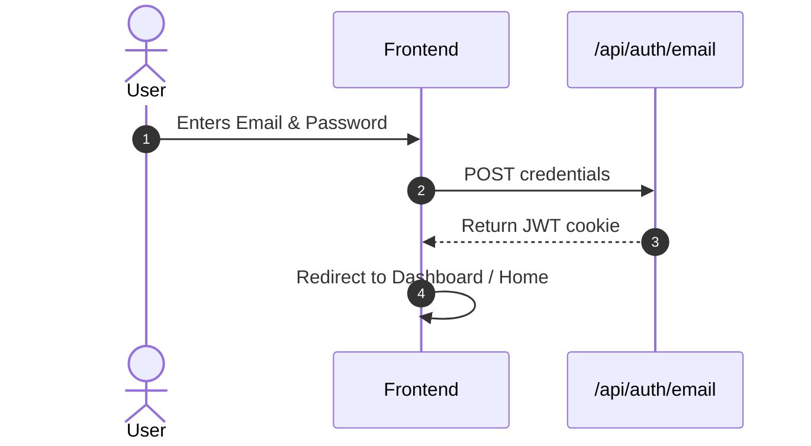
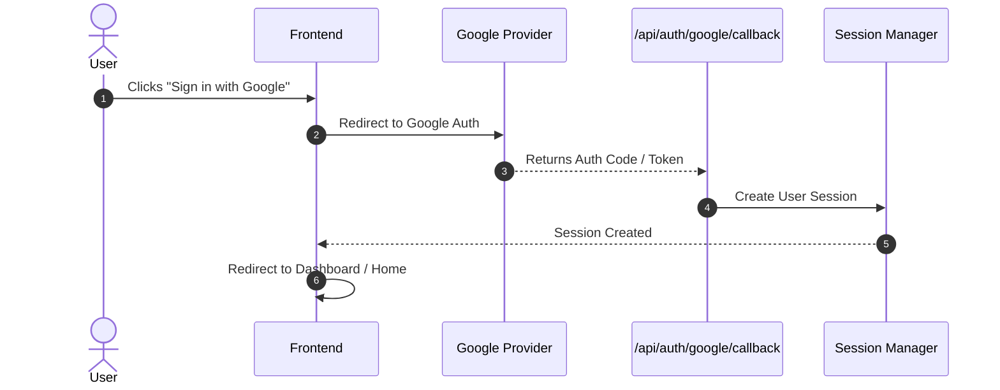
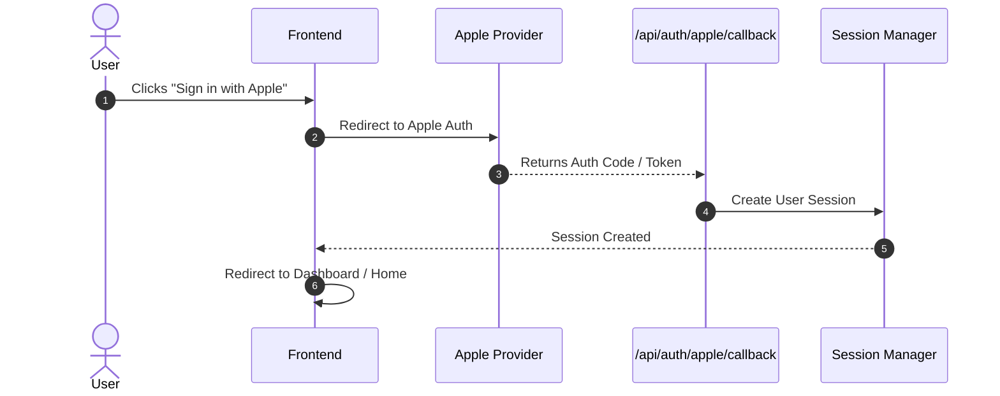

# Authentication Flows

This document outlines the three primary authentication flows used in the EventHivez application.

## 1. Email / JWT Flow
Standard email and password authentication resulting in a stateless JWT cookie.

## 2. Google OAuth Flow

## 3. Apple OAuth Flow

